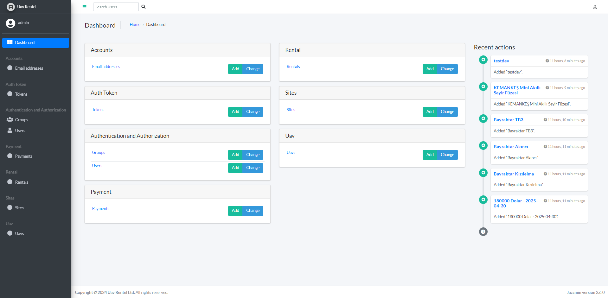
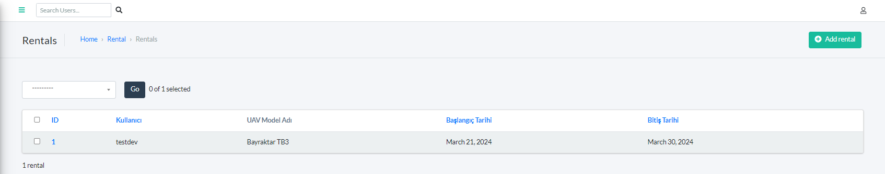
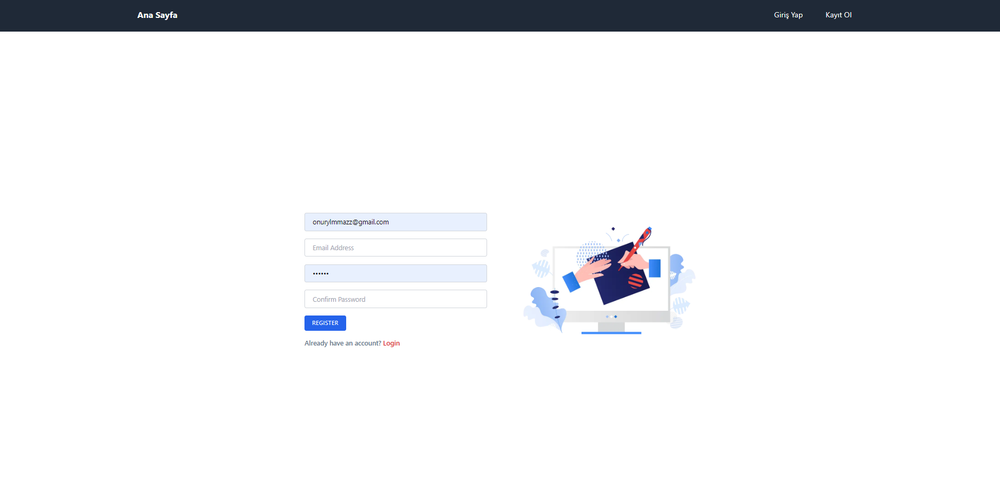
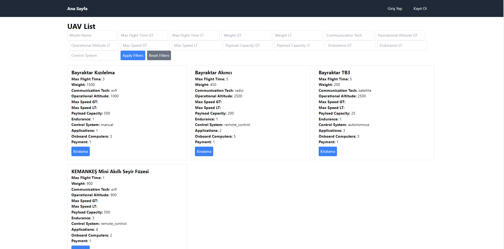
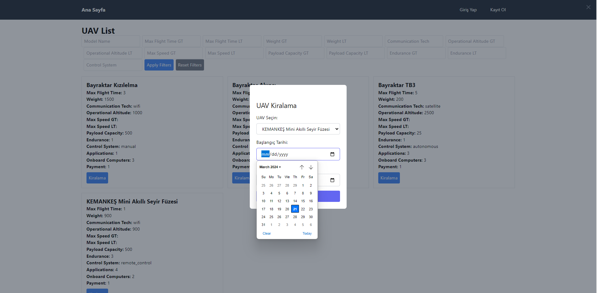

#  UAV Rental Service

This project facilitates a rental service for drones and UAVs (Unmanned Aerial Vehicles), allowing users to rent available UAVs for their selected dates. It's built using the Django REST Framework alongside other packages to provide a robust and user-friendly backend.

## Key Features

- **UAV Rental:** Users can choose and rent UAVs for specific dates, given that the UAV is not already rented out.
- **User Authentication:** Integrated user authentication and registration using `dj-rest-auth` and `allauth`.
- **Advanced Filtering:** `django-filters` for sophisticated search, filtering, and pagination capabilities in UAV listings.
- **Admin Panel Customization:** Enhanced admin interface using `jazzmin` for a more accessible and user-friendly experience.
- **Frontend Integration:** Frontend built with React, allowing for a dynamic and responsive user interface.

## Technologies Used

- **Backend:** Django, Django REST Framework
- **Authentication:** dj-rest-auth, allauth
- **Filtering and Pagination:** django-filters
- **Admin Interface:** jazzmin
- **Frontend:** React
- **Database:** PostgreSQL

## Database Information

The database information for this project is public. I've utilized the free PostgreSQL service provided by [Render.com](https://render.com) for this purpose.


## Getting Started

### Prerequisites

- Python 3.x
- Docker (optional)
- Node.js 

### Setting Up the Environment

#### Using virtualenv

1. Clone the repository:

```bash
git clone https://github.com/10are/rental_application.git
```

2. Set up a virtual environment and activate it:

```bash
python -m venv env
source env/bin/activate # On Windows, use env\Scripts\activate
```

3. Install the requirements:

```bash
pip install -r requirements.txt
```

#### Using Docker
```bash
docker-compose build
docker-compose up
```

#### Frontend
```bash
cd template
npm i
npm start
```
#### Test
```bash
python manage.py test
```

## Gallery





